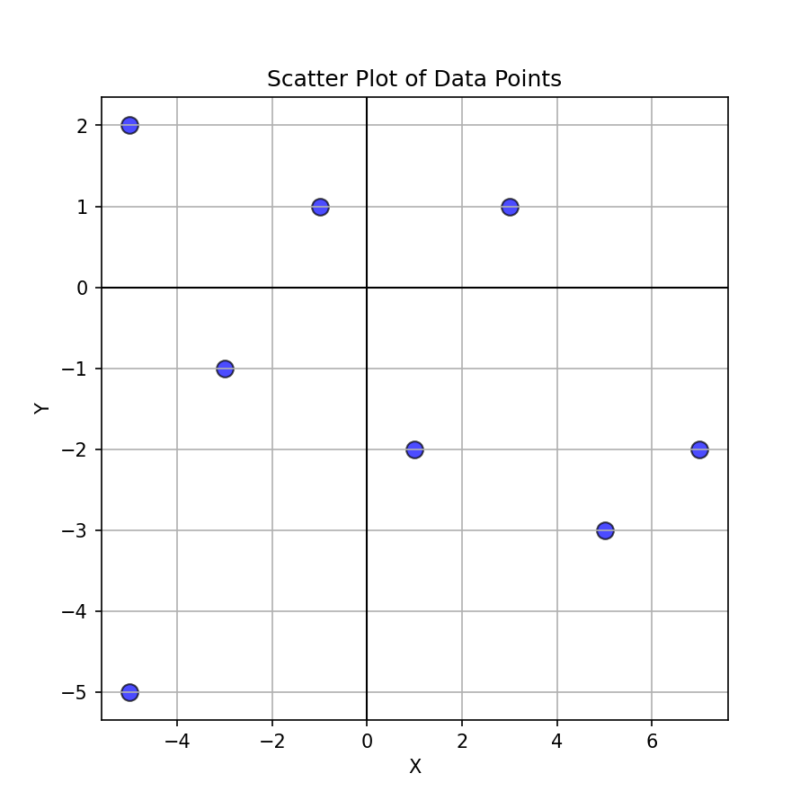

# 📊 Correlation Analysis (Midterm Exam Report – Assignment 1)

**Author:** Sofio Katamadze
**Course:** Machine Learning for Cybersecurity

This report documents the process of **finding Pearson’s correlation coefficient** for the dataset hidden inside the page `max.ge/aiml_midterm/702943_html`.
The task required not only to compute correlation but also to describe the process and visualize the result.

---

## 1. Data Retrieval

For my case (student email: `s.qatamadze2024@sangu.edu.ge`), the dataset was:

```
(3,1), (7,-2), (5,-3), (1,-2),
(-5,-5), (-3,-1), (-1,1), (-5,2)
```

I extracted these coordinates manually and saved them in a CSV file for reproducibility:

**`data/points.csv`**

```csv
x,y
3,1
7,-2
5,-3
1,-2
-5,-5
-3,-1
-1,1
-5,2
```

---

## 2. Pearson Correlation – Theory

The **Pearson correlation coefficient** measures the **linear relationship** between two variables:

[
r = \frac{\sum_{i=1}^{n} (x_i - \bar{x})(y_i - \bar{y})}{\sqrt{\sum_{i=1}^{n}(x_i - \bar{x})^2} \cdot \sqrt{\sum_{i=1}^{n}(y_i - \bar{y})^2}}
]

* ( r \in [-1, 1] )
* ( r = 1 ): Perfect positive linear correlation
* ( r = -1 ): Perfect negative linear correlation
* ( r = 0 ): No linear correlation

---

## 3. Implementation

I developed a small **Python console application**.
The key files are:

* [`src/correlation.py`](src/correlation.py) — computes Pearson correlation (`scipy.stats.pearsonr`)
* [`src/visualize.py`](src/visualize.py) — scatter plot visualization with `matplotlib`
* [`app.py`](app.py) — CLI entry point

### Run command:

```bash
python3.12 app.py --data data/points.csv --plot figs/scatter.png
```

### Example output:

```
Pearson correlation coefficient: -0.1172
P-value: 0.7823
Scatter plot saved to figs/scatter.png
```

---

## 4. Results

* **Pearson r = -0.1172**
* **P-value = 0.7823**

### Interpretation:

* The correlation is very close to **0** → meaning there is **no strong linear relationship** between X and Y.
* High p-value (> 0.05) confirms that the observed relationship is not statistically significant.

---

## 5. Visualization

The scatter plot shows the distribution of the points:

📍 **Figure:** `figs/scatter.png`



* Blue dots represent the data points.
* Axes are drawn for better reference.
* The spread of points confirms **no clear linear trend**.

---

## 6. Reproducibility

To reproduce:

1. Clone repo.
2. Install dependencies:

   ```bash
   pip install -r requirements.txt
   ```
3. Run correlation analysis:

   ```bash
   python3.12 app.py --data data/points.csv --plot figs/scatter.png
   ```

---

✅ **Final conclusion:** The given dataset does not demonstrate a significant correlation between X and Y (Pearson r ≈ -0.12).

---